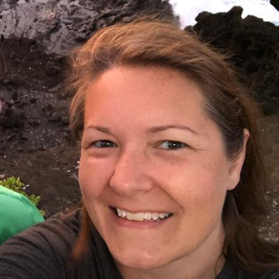

  

<h1 align="center">{{ page.title }}</h1>
<h2 align="center">{{ page.subtitle }}</h2>

I am a proud mother of 2 children and have been married for a long time (*cough cough* over 25 years) to a wonderful husband. We are also blessed with 2 wonderful grandchildren.  Being empty nesters with kids that live in different areas of the country, my husband and I actually decided to have a semi-nomadic life and are full-time RVers.  

    

Originally from the lakes area of Kentucky, I love to travel and see other parts for the country and world.  We usually will spend some time fishing anywhere we go, as this is one of our favorite hobbies.  I also love to read.  Some of my favorites are the Harry Potter books.  My family and I are Potter-Heads!!

  

---

## 🚀 AI Advocacy

I actively **use and advocate for AI tools** to help developers and teams work smarter. By integrating assistants like **GitHub Copilot** and other AI-powered solutions into workshops, documentation, and enablement, I demonstrate how AI can accelerate repetitive tasks, reduce context-switching, and inspire new ideas. 

My focus is on **responsible AI adoption**—showing where AI can amplify productivity while making clear where human judgment, creativity, and collaboration remain essential. I coach both customers and colleagues on how to embrace AI safely and effectively, making it a natural part of their toolchain and day-to-day workflows.

## 🧰 My Work at GitHub

I combine **technical expertise** with a passion for **teaching, mentoring, and advocacy**. I build hands‑on workshops and clear documentation that help developers see GitHub as more than a source repo—it’s a **productivity engine**. I’ve created enablement paths that translate features into workflows (and wins), so individuals and teams can get value quickly.

Internally, I’ve contributed **onboarding** materials for Engagement Managers and Project Managers and I actively **mentor** new team members. My goal is to multiply impact—turning knowledge into repeatable practices, and turning first‑time tasks into reliable playbooks that others can adopt.

## My Previous Work

I have worked for Hewlett Packard Enterprise for over 3 years as a Product Development Engineer.  In this role, I have been responsible for the design and implementation of third party Source Code Management (SCM) tools used by the company’s internal developers.  These tools have included Team Foundation Server (on-premise), GitHub Enterprise and CollabNet TeamForge (Subversion/Gerrit).  I have also been an avid user of the many Build/Deploy, DevOps and Quality Management tools that are also hosted by my team, including Jenkins, FlowDock, Hubot and Docker.  

I am also an internal advocate for DevOps practices and Social Coding.   In this role, I have presented and shared best practices and my experiences to other developers and business groups within the company.  I enjoy showing our developers how DevOps can make their jobs easier by using automation, pipelines, APIs and ChatOps to complete repetitive tasks.  I enjoy showing someone how something as simple as creating a Pull Request in GitHub Enterprise or sending a message to a Hubot in a ChatOps tool can start a chain of automate events making their jobs easier.  I also like to stress to our developers that if a job can be automated, there is less of a chance of “Human Error” being introduced.

My background is not that of traditional IT.  For six years prior to starting my career at Hewlett Packard Enterprise, I worked as a Telecommunications Operator, which to most people is an Emergency 911 Operator.  While in this position, I was responsible for taking emergency calls, gathering information from the callers, passing that information on to the appropriate agency/agencies (Police, Fire, Rescue, EMS, etc.), de-escalating situations and giving the caller instructions over the phone.  All of my actions could have been the difference in life or death for not only the callers, but also the emergency responders.  This was, by no means, an easy job.  It takes patience, the ability to calm others (even if you are not), and the ability to multi-task.  Many times, I would be listening to a caller, giving instructions to emergency responders and typing notes in the recording system all at the same time.  As you can imagine, it was a stressful job.  However, I enjoyed every minute of it and found it to be very rewarding.  The last nine months at my last Telecommunications position, I was also the Supervisor and was charged with creating the training materials and program for future Telecommunications Operators.  

---

## My Future Work

I want to continue to grow my skills and watch the lightbulb light up for the people and teams that I interact with.  Organization and process definition is a passion of mine.  I am drawn to look at life from the perspective of how the outcome has been achieved and how could that be made better and have been doing this my whole life with EVERYTHING.  Finding inefficiencies in a process and working to resolve and streamline the process with as many low-touch steps as possible sometimes drives my husband crazy.  But, it is something I love to do and find relaxing.

I am also passionate about helping others.  I love to mentor and coach people to help them achieve their goals.  I have been told that I am a great teacher and that I can take complex topics and break them down into simple, easy to understand concepts.  I want to continue to do this in my career and help others achieve their goals, whether it is through training, mentoring, or just being a sounding board for ideas.

## 🌎 About Me

I’m passionate about **advocating for developers**—helping them understand not just how to use tools, but how to unlock their full potential through them. Whether I’m guiding customers in adopting GitHub best practices, or coaching teammates through complex engagements, I focus on enabling others to be more effective and confident.

Beyond the technical side, I love **mentoring new colleagues**, building **onboarding resources**, and ensuring no one has to start from scratch. Helping people connect the dots, shorten their learning curve, and feel successful is one of the most rewarding parts of my work.

## 🌟 Highlights & Achievements
- 🚀 Championed adoption of **GitHub Copilot** and AI tools to boost developer productivity and enable responsible use.
